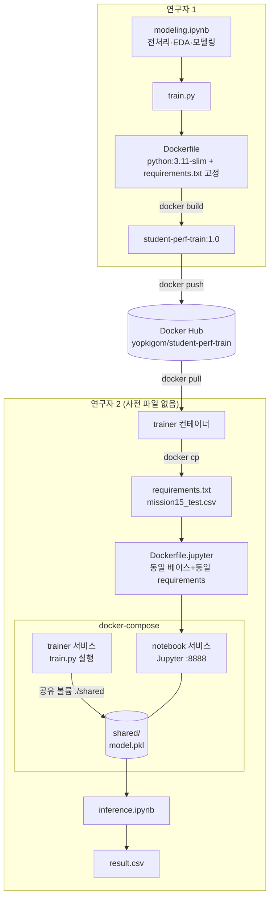

# 미션 15 보고서

## 1. Docker Hub URL

```
https://hub.docker.com/r/yopkigom/student-perf-train
이미지: yopkigom/student-perf-train:1.0
digest: sha256:fc70881b0c5ea9a5d9c617d6f529d66412f1a37eb5ce9f38f5cf431a22975ef9
```

## 2. 연구자1 : 데이터 전처리 및 모델링 결과 요약

### 데이터·전처리
| 항목 | 내용 |
|---|---|
| 학습 데이터 | 7,000행 × 6열 (결측치 없음) |
| 중복 제거 | 7,000 → 6,936행 (64행 중복) |
| 인코딩 | Extracurricular Activities: Yes/No → 1/0 |
| 스케일링 | StandardScaler (모델 파이프라인에 내장) |

### EDA 핵심 발견
| 변수 | 목표변수와의 상관 |
|---|---|
| Previous Scores | **0.914** (지배적) |
| Hours Studied | 0.374 |
| Sample Question Papers Practiced | 0.050 |
| Sleep Hours | 0.049 |
| Extracurricular Activities | 0.025 |

→ 뚜렷한 선형 구조를 확인하여 선형 회귀 계열 채택 근거로 삼았습니다.

### 모델링 결과 (검증 20%, seed=42)
| 모델 | RMSE | R² |
|---|---|---|
| **LinearRegression (선택)** | **2.0375** | 0.989 |
| Ridge(alpha=1.0) | 2.0376 | 0.989 |

- 목표변수 범위 10~100 대비 RMSE 2.04 → 우수
- 최종 모델: 전체 데이터로 재학습한 `StandardScaler + LinearRegression` 파이프라인 → `model.pkl` (1,606 bytes)
- 노트북(컨테이너 실행)과 train.py(도커 이미지 실행)의 RMSE 완전 일치 → 재현성 검증 완료

### 연구자 2 — 추론 결과
- `shared/result.csv`: 3,000행, 원본 5개 특성 + `Predicted Performance Index`
- 예측값 분포가 학습 목표변수 범위(10~100)와 정합합니다.

## 3. 코드 아키텍처 도식



## 4. 참고사항

**① 버전 통일**: 두 이미지 모두 `python:3.11-slim-bookworm` 베이스 입니다.  
연구자 2는 requirements.txt를 전달받지 않고 **이미지에서 `docker cp`로 추출**해  
그대로 빌드해서 사용함으로 버전 불일치 가능성이 구조적으로 차단됩니다.
(검증: 추출본과 원본 diff 동일, 노트북/컨테이너 RMSE 일치)

**② 파일 전달**: model.pkl은 compose **공유 볼륨**(`./shared:/app/output`)으로,  
test.csv는 정지 컨테이너에서 **`docker cp`**로 전달됩니다.  
`depends_on: service_completed_successfully`로 학습 완료 후에만  
추론 컨테이너가 기동되도록 순서를 보장하였습니다.

## 5. 실행 명령어 시퀀스 (재현용)

### 연구자 1 — train.py 추출 → 이미지 빌드 → Hub push

작업 디렉토리: `mission-result/researcher1/`

```bash
# 1) 노트북에서 스크립트 추출 (modeling.ipynb -> train.py)
#    --to script: 코드 셀만 .py로 변환, 마크다운은 주석으로 보존
jupyter nbconvert --to script modeling.ipynb --output train

# 2) 이미지 빌드 (현재 디렉토리 = 빌드 컨텍스트: Dockerfile/train.py/requirements.txt/data)
docker build -t yopkigom/student-perf-train:1.0 .

# 3) 로컬 검증: 컨테이너 실행 -> model.pkl 산출 확인
docker run --rm -v "$(pwd)/output:/app/output" yopkigom/student-perf-train:1.0
ls -l output/model.pkl

# 4) Docker Hub 로그인
docker login -u yopkigom

# 5) Hub로 push
docker push yopkigom/student-perf-train:1.0

# 6) (선택) digest 확인 -> 보고서 기록용
docker inspect --format='{{index .RepoDigests 0}}' yopkigom/student-perf-train:1.0
```

### 연구자 2 — Hub pull → 버전 파일 추출 → compose로 환경 동기화

작업 디렉토리: `mission-result/researcher2/` (사전 공유 파일 없음)

```bash
# 1) Hub에서 학습 이미지 pull
docker pull yopkigom/student-perf-train:1.0

# 2) 실행하지 않는 임시 컨테이너 생성 (정지 상태)
docker create --name tmp-train yopkigom/student-perf-train:1.0

# 3) 이미지에 고정된 requirements.txt 추출 -> 버전 통일 (구조적 불일치 차단)
docker cp tmp-train:/app/requirements.txt ./requirements.txt

# 4) 테스트 데이터 추출 -> 공유 볼륨 위치(shared/)로
docker cp tmp-train:/app/data/mission15_test.csv ./shared/mission15_test.csv

# 5) 임시 컨테이너 제거
docker rm tmp-train

# 6) compose 기동: notebook 이미지 빌드 -> trainer(train.py) 실행
#    -> ./shared 공유 볼륨에 model.pkl 생성 -> 완료 후 notebook 서비스 기동
docker compose up --build -d

# 7) trainer 완료 및 산출물 확인
docker compose logs trainer
ls -l shared/model.pkl

# 8) Jupyter 접속 토큰 확인 후 http://localhost:8888 접속
docker compose logs notebook | grep -i token

# 9) inference.ipynb 실행으로 shared/result.csv(3,000행) 생성

# 10) 환경 정리
docker compose down
```

**순서 보장 근거**: `docker-compose.yml`의  
`depends_on.trainer.condition: service_completed_successfully` 설정 →  
trainer가 `model.pkl` 생성을 마친 뒤에만 notebook 서비스가 기동되어,  
추론 시점에 모델 파일 존재가 보장됩니다.

## 6. 제출 폴더 구조

```
mission-result/
├── researcher1/
│   ├── modeling.ipynb      # 전처리·EDA·모델링 (출력 포함)
│   ├── train.py            # 파이프라인 스크립트
│   ├── requirements.txt    # 고정 버전
│   ├── Dockerfile
│   ├── data/               # train/test csv
│   └── output/model.pkl
└── researcher2/
    ├── Dockerfile.jupyter
    ├── docker-compose.yml
    ├── inference.ipynb     # 추론 과정 (출력 포함)
    ├── requirements.txt    # 이미지에서 docker cp로 추출한 사본
    └── shared/             # model.pkl, mission15_test.csv, result.csv
```
