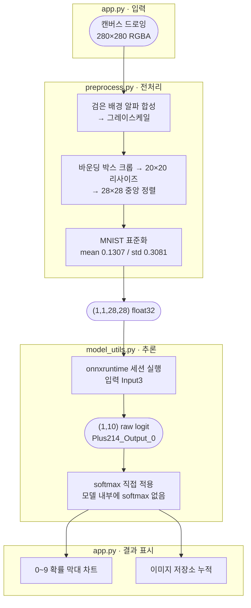

# 손글씨 숫자 인식 웹 서비스 (Streamlit + ONNX + Docker)

과제 식별: [스프린트 미션 17](https://www.codeit.kr/topics/studyGroupStep6985c0d690c7e12606331075/lessons/14113)
작성: 2026.07.21 신호정

도커 Hub 위치 : https://hub.docker.com/r/yopkigom/input-recognition-pilot

실행 방법 : 포트는 가용한 것으로 바꾸셔도 됩니다.(-p 8501:8501)
```bash
docker run --rm -p 8501:8501 yopkigom/input-recognition-pilot:1.0
```

---

## A. 프로젝트 개요

### A-a. 목적

캔버스에 마우스로 그린 손글씨 숫자를 ONNX 모델로 추론하는 웹 서비스를 만들고,  
이를 Docker 이미지로 패키징해 Docker Hub에 배포합니다.

### A-b. 요구사항 대비 구현 결과

| 요구사항 | 구현 |
|---|---|
| 입력 캔버스 | `streamlit-drawable-canvas` 기반 280×280 드로잉 |
| 전처리 이미지 표시 | 모델 입력 28×28을 NEAREST 확대해 픽셀 단위 확인 가능 |
| 모델 추론 결과 | 0 ~ 9 각 클래스 확률 막대 차트 + 최고 확률 레이블 |
| 이미지 저장소 | 썸네일, 레이블, 확률 누적(세션 한정), 8개 이상 시 스크롤 |
| 모델 관리 | 런타임 다운로드 + 캐싱(이미지에 모델 미포함) |
| 이미지 처리·추론 | 전처리 함수와 추론 함수를 모듈 분리 |
| 배포 | Dockerfile → 빌드 → localhost 확인 → Docker Hub 업로드 |

### A-c. 산출물

| 구분 | 내용 |
|---|---|
| 소스 | `app.py`, `model_utils.py`, `preprocess.py`, `verify_preprocess.py` |
| 배포 | `Dockerfile`, `requirements.txt`, `.dockerignore` |
| 이미지 | `yopkigom/input-recognition-pilot:1.0` / `:latest` |

---

## B. 시스템 구성

### B-a. 모듈 구조

기능 구현을 셋으로 분리했습니다.  
전처리와 추론을 분리하라는 요구사항을 만족하면서,  
전처리 모듈이 Streamlit와 ONNX에 의존하지 않아 단독 검증이 가능해지도록 구성하였습니다.

| 모듈 | 책임 | 외부 의존 |
|---|---|---|
| `preprocess.py` | 캔버스 RGBA → `(1,1,28,28)` 텐서 + 미리보기 | Pillow, numpy |
| `model_utils.py` | 모델 다운로드, 캐싱, 세션 로드, 추론(softmax) | onnxruntime, requests, streamlit |
| `app.py` | UI 4영역 구성, 세션 상태 관리 | streamlit, drawable-canvas |
| `verify_preprocess.py` | 전처리 설계 근거, 파이프라인 재현 검증 | (개발용, 이미지 미포함) |

### B-b. 데이터 흐름

각 단계를 담당 모듈별로 묶었습니다. 둥근 노드는 데이터 상태, 사각 노드는 연산입니다.



### B-c. 모델 사양

ONNX Model Zoo의 `mnist-12.onnx`(opset 12, **26,143 bytes**)를 사용합니다.

| 항목 | 값 |
|---|---|
| 입력 | `Input3`, `(1,1,28,28)` float32 (배치 고정 1) |
| 출력 | `Plus214_Output_0`, `(1,10)` float32 |
| 내부 softmax | **없음** (마지막 연산이 `Add`) |
| 구조 | Conv → Add → ReLU → MaxPool → … → MatMul → Add |

---

## C. 코드 설명

### C-a. `preprocess.py` : 전처리

#### C-a-1. 검은 배경 알파 합성

`streamlit-drawable-canvas`의 `image_data`는 미입력 영역이 투명(alpha=0)일 수 있습니다.  
검은 배경에 알파 합성한 뒤 그레이스케일로 변환해,  
MNIST와 동일한 **흰 글씨 / 검은 배경**을 보장합니다.

#### C-a-2. MNIST 관례 중앙 정렬

손그림은 위치와 크기가 제각각이라 학습 분포와 어긋납니다.  
전경 픽셀의 바운딩 박스로 잘라내고, 긴 변을 20px에 맞춰 종횡비를 유지한 뒤 28×28 캔버스 중앙에 배치합니다.  
MNIST 원본이 20×20 박스를 28×28에 중앙 배치한 것과 같은 방식입니다.

#### C-a-3. 표준화

`(픽셀/255 - 0.1307) / 0.3081`을 적용합니다. 선택 근거는 D-b에서 서술하겠습니다.

### C-b. `model_utils.py` : 모델 관리와 추론

#### C-b-1. 다운로드와 캐싱

모델을 이미지에 굽지 않고 최초 실행 시 내려받습니다.  
`@st.cache_resource`로 추론 세션을 프로세스 수명 동안 재사용해,  
매 요청마다 재다운로드, 재초기화하지 않습니다.

#### C-b-2. 방어적 처리

- 다운로드 실패 시 `RequestException`을 잡아 원인이 드러나는 메시지로 변환합니다.
- 받은 파일이 10KB 미만이면 **LFS 포인터로 판단해 거부**하도록 예외처리 합니다(D-a 참조).
- 임시 파일에 기록 후 `os.replace`로 원자적 교체해, 중단 시 손상된 캐시가 남지 않게 합니다.

#### C-b-3. softmax

모델 출력이 raw logit이므로 최댓값을 빼는 수치 안정 softmax를 직접 적용합니다.

### C-c. `app.py` : UI

4개 영역을 좌우 2열 + 하단 저장소로 배치합니다.
캔버스 해시 기반 중복 추론 방지(D-e)와 이미지 저장소 스크롤(D-f)이 주요 로직입니다.

### C-d. `verify_preprocess.py` : 검증

전처리 설계 근거를 코드로 남겨 제3자가 재현할 수 있게 했습니다.

---

## D. 핵심 기술 결정과 근거

### D-a. 모델 다운로드 : Git LFS 이슈

#### D-a-1. 이슈 설명

`onnx/models` 저장소는 모델 파일을 **Git LFS**로 관리합니다.
따라서 통상적인 raw URL은 실제 모델이 아니라 포인터 텍스트를 반환합니다.

| URL | 응답 |
|---|---|
| `raw.githubusercontent.com/…/mnist-12.onnx` | **130 bytes** LFS 포인터 텍스트 |
| `media.githubusercontent.com/media/…/mnist-12.onnx` | **26,143 bytes** 실제 모델 |

단순히 `requests.get(raw_url)`로 받으면 130바이트 텍스트를 모델로 착각해 ONNX 로드 단계에서야 실패하게 됩니다.

#### D-a-2. 대응

LFS 미디어 엔드포인트를 사용하고,  
**파일 크기 하한(10KB) 검사**를 추가해 포인터가 내려오는 상황을 다운로드 시점에 즉시 잡도록 했습니다.

### D-b. 전처리 방식 : 실측으로 결정

#### D-b-1. 확인이 필요했던 이유

ONNX 모델은 연산을 순서대로 이어 붙인 그래프입니다.  
모델에 따라서는 그래프 맨 앞에 정규화 연산(평균 빼기, 255로 나누기 등)이 들어 있어,  
원본 픽셀값을 그대로 넣어도 모델이 알아서 맞춰 주기도 합니다.  
그러나 mnist-12.onnx의 그래프 앞부분을 직접 확인해 보니 Conv → Add → ReLU → MaxPool 순이었습니다.  
입력 Input3에 곧바로 합성곱이 걸리며, 정규화 연산이 하나도 없습니다.  
모델이 입력을 이미 학습 당시의 형태로 가정한다는 뜻이므로,  
스케일과 흑백 방향은 애플리케이션이 책임져야 하는 것으로 분석되었습니다.
게다가 ONNX Model Zoo가 함께 배포하는 공식 테스트 텐서는 값 범위가 -36 ~ 32로 자연스러운 이미지 스케일이 아니어서,  
어떤 형태로 넣어야 하는지 알려 주지 못하고 있습니다.  
문서에도 모델에도 정답이 없어 실측으로 결정해야 했습니다.

#### D-b-2. 실험

MNIST 공식 테스트셋(t10k) 앞 500장으로 후보를 비교했습니다. 결과는 F-a에서 확인하시면 됩니다.

#### D-b-3. 결론

- 반전 여부가 결정적 : 반전 시 31%로 붕괴하므로 흰 글씨/검은 배경을 유지합니다.  
	캔버스도 검은 배경 + 흰 펜으로 설정해 전처리 단계의 반전을 아예 없앴습니다.
- 스케일은 예측 레이블을 거의 바꾸지 못함 : 모델에 bias(`Add`) 연산이 있어  
  입력에 양의 배율을 곱해도 로짓이 같은 비율로 커지지는 않습니다.  
  실측하니 0~255와 /255의 로짓 비율은 220~440으로 일정하지 않았습니다.  
  다만 입력이 커질수록 bias의 기여가 상대적으로 작아져 순위는 대체로 보존되며,  
  **500장 중 497장(99.4%)에서 예측이 일치**했습니다.  
  양쪽 정확도가 98.6%로 같게 나온 것은 맞힌 개수가 우연히 일치한 결과이지 동일한 동작은 아닙니다.  
  따라서 **결정적인 변수는 스케일이 아니라 반전 여부**입니다.
- 다만 스케일은 **softmax 분포의 날카로움**을 바꿉니다.  
	0~255를 그대로 넣으면 로짓이 과도하게 커져 막대 차트가 한 클래스 100%로 보이게 됩니다.  
	차트 가독성과 정확도(98.8%)를 함께 고려해 MNIST 표준화를 채택했습니다.

### D-c. 의존성 버전 핀 고정

`streamlit-drawable-canvas 0.9.3`은 `streamlit.elements.image.image_to_url`에 의존하는데,  
이 심볼은 이후 streamlit에서 이동, 제거되어 최신 버전과 조합하면 import 단계에서 터집니다.
따라서 `streamlit==1.27.2`와 `streamlit-drawable-canvas==0.9.3`을 함께 고정했습니다.
`requirements.txt`에 전체 의존성도 모두 명시적으로 고정해 재현성을 확보했습니다.

### D-d. Pillow 전용 (OpenCV 배제)

전처리를 Pillow + numpy로만 구현 했습니다.
`opencv-python`은 `libGL1` 등 시스템 라이브러리를 요구해서,  
slim 계열 베이스 이미지에 apt 패키지를 추가해야 합니다.  
Pillow로 동일 기능을 구현할 수 있으므로 **컨테이너 의존성을 줄이고 용량을 감량하는 쪽**을 택했습니다.

### D-e. 중복 추론 방지

`st_canvas`는 상호작용마다 스크립트를 재실행합니다.  
최초 구현에서는 슬라이더 조작이나 버튼 클릭처럼  
**그림이 바뀌지 않은 재실행**에서도 전처리, 추론이 반복되는 구조였습니다.  

따라서, 캔버스 배열의 SHA-1 해시를 세션에 보관하고  
해시가 같으면 이전 결과를 재사용하도록 하였습니다.  
해시 계산은 313,600바이트 기준 **0.138ms**로 전처리(**0.583ms**)의 약 1/4 수준이라 타당한 처리였습니다.

### D-f. 이미지 저장소 스크롤 문제

저장소가 쌓이면 화면이 계속 길어지는 문제가 있었습니다.  
Streamlit의 표준 해법인 `st.container(height=...)`는 1.31 이후 기능이라  
1.27.2에 고정된 본 프로젝트에서는 쓸 수 없었습니다.

따라서 썸네일을 **data URI로 인라인한 HTML**을 직접 렌더링하고  
`overflow-y: auto` 그리드로 스크롤 영역을 구성하는 방법으로 구현했습니다.

---

## E. 배포

### E-a. Dockerfile 설계

| 결정 | 내용 |
|---|---|
| 베이스 | `python:3.11-slim-bookworm` (미션 15와 통일) |
| 시스템 패키지 | `libgomp1`만 설치 (onnxruntime의 OpenMP 요구) |
| 레이어 순서 | `requirements.txt` 먼저 복사·설치 후 소스 복사 (캐시 활용) |
| 모델 | 이미지에 미포함, 런타임 다운로드 |
| 헬스체크 | streamlit `/_stcore/health` 폴링 |

### E-b. 시크릿 유출 방지

모델을 **GitHub 공개 LFS 리소스**에서 받으므로 다운로드용 자격증명이 애초에 존재하지 않습니다.  
사후 방어보다 **자격증명을 만들지 않는 설계**를 우선했습니다.  
`.dockerignore`·`.gitignore` 양쪽에 `*.key`·`.env`·캐시 디렉토리를 등록했고,  
배포 직전 이미지 내부를 직접 열어 `/app`에 소스 4개 외에  
시크릿·모델 파일이 없음을 확인했습니다.

### E-c. 배포 및 검증

`:1.0`(버전)과 `:latest`(연관) 두 태그를 푸시했습니다.  
`latest` 단독 사용은 버전 추적이 불가능해지므로 피했습니다.  

배포가 실제로 유효한지 확인하기 위해  
**로컬 이미지를 완전히 삭제한 뒤 Docker Hub에서 새로 받아** 검증했습니다.

| 항목 | 결과 |
|---|---|
| digest 일치 | `sha256:ae278ad5…` 동일 |
| 헬스체크 | `200 ok` (기동 약 2초) |
| 모델 다운로드 | 26,143 bytes 정상 |
| 추론 | 확률 합 1.0, shape `(10,)` |
| 로그 | 오류 없음 |

---

## F. 검증 결과

검증 데이터는 MNIST 공식 테스트셋(t10k)이며 PyTorch 공식 미러(ossci-datasets S3)에서 받았습니다.  
표본은 테스트셋 **앞에서부터 순서대로** 사용하였습니다(무작위 추출 아님).  
앞 500장의 클래스 분포는 40~67개로, 특정 숫자에 치우치지 않음을 확인했습니다.

### F-a. 전처리 설계 실험 (앞 500장)

| 후보 | 정확도 |
|---|---|
| raw 0~255 (반전 없음) | 98.6% |
| /255 0~1 (반전 없음) | 98.6% |
| **MNIST 표준화 (반전 없음)** | **98.8%** |
| raw 0~255 (반전) | 31.0% |
| /255 0~1 (반전) | 34.4% |

raw와 /255는 정확도가 같지만 동일한 동작은 아닙니다.  
500장 중 497장(99.4%)에서만 예측이 일치하며, 로짓 비율도 220~440으로 일정하지 않습니다(D-b-3 참조).

### F-b. 파이프라인 검증 (앞 300장)

`preprocess.py`를 실제로 통과시킨 정확도는 **95.7%**입니다.  
28×28을 280×280으로 늘렸다가 다시 줄이는 이중 리사이즈가 포함되므로  
F-a의 직접 추론보다 낮게 나오는 것이 정상입니다.  
실제 드로잉은 이 왜곡이 없어 더 유리합니다.  

shape/dtype/softmax 합/빈 입력 방어도 함께 검사하였습니다.

### F-c. 성능 측정 : On-Device 관점

컨테이너 내부 CPU 기준 200회 평균낸 수치입니다.

| 단계 | 지연시간 |
|---|---|
| 전처리 | 0.71 ms |
| 추론 | 0.03 ms |
| **합계** | **0.74 ms** |

주목할 점은 **전처리가 추론보다 약 24배 비싸다**는 것입니다.  
모델이 26KB에 불과해 추론 자체는 사실상 무시할 수 있는 수준이고,  
병목은 이미지 변환 파이프라인에 있는 것으로 보입니다.  

**전체 지연시간을 먼저 프로파일링하고 병목 단계를 특정하는 것**이  
모델 최적화보다 우선한다는 것을 보여줍니다.

---

## G. 한계와 개선 방향

### G-a. 이미지 용량

현재 980MB(압축 220MB)로 가볍지 않습니다.  
onnxruntime·pandas·pyarrow가 대부분을 차지합니다.  
막대 차트를 pandas 없이 구성하고 멀티스테이지 빌드를 적용하면 축소 여지가 있습니다.  

### G-b. 저장소의 휘발성

이미지 저장소는 `st.session_state` 기반이라 새로고침 시 사라집니다.  
과제 요건(세션 내 누적)에는 부합하나, 영속화하려면 별도 스토리지가 필요합니다.  

### G-c. 손그림 분포 차이

MNIST는 필기 데이터를 정규화한 것이라 마우스 드로잉과는 획 두께, 필압 분포가 다릅니다.
중앙 정렬로 상당 부분 보정했으나, 지나치게 얇거나 치우친 입력은 여전히 취약합니다.
펜 굵기 조절 슬라이더로 사용자가 보정할 수 있게 했습니다.

### G-d. 검증 표본

표본을 앞에서부터 순차 추출했습니다.  
클래스 분포 확인으로 편향은 배제했으나, 엄밀하게는 무작위 추출 후 반복 측정하는 편이 낫습니다.