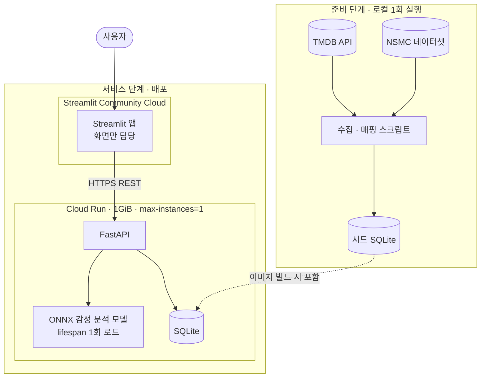
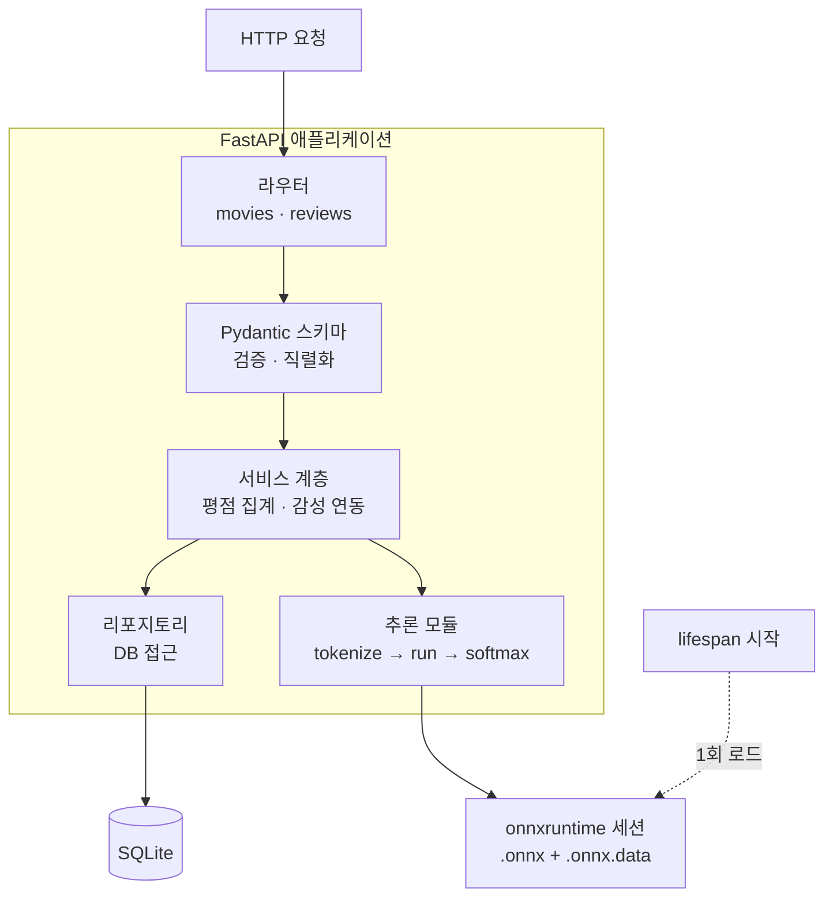
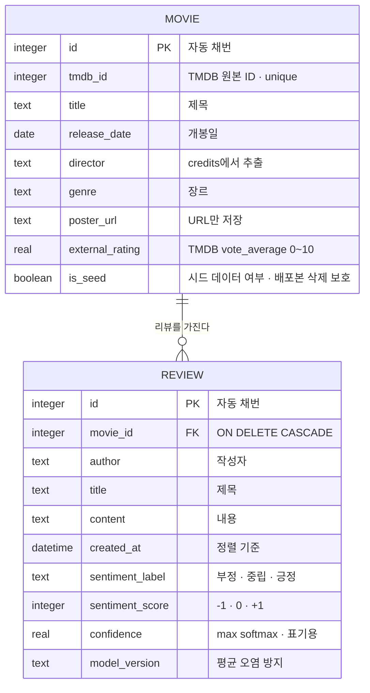
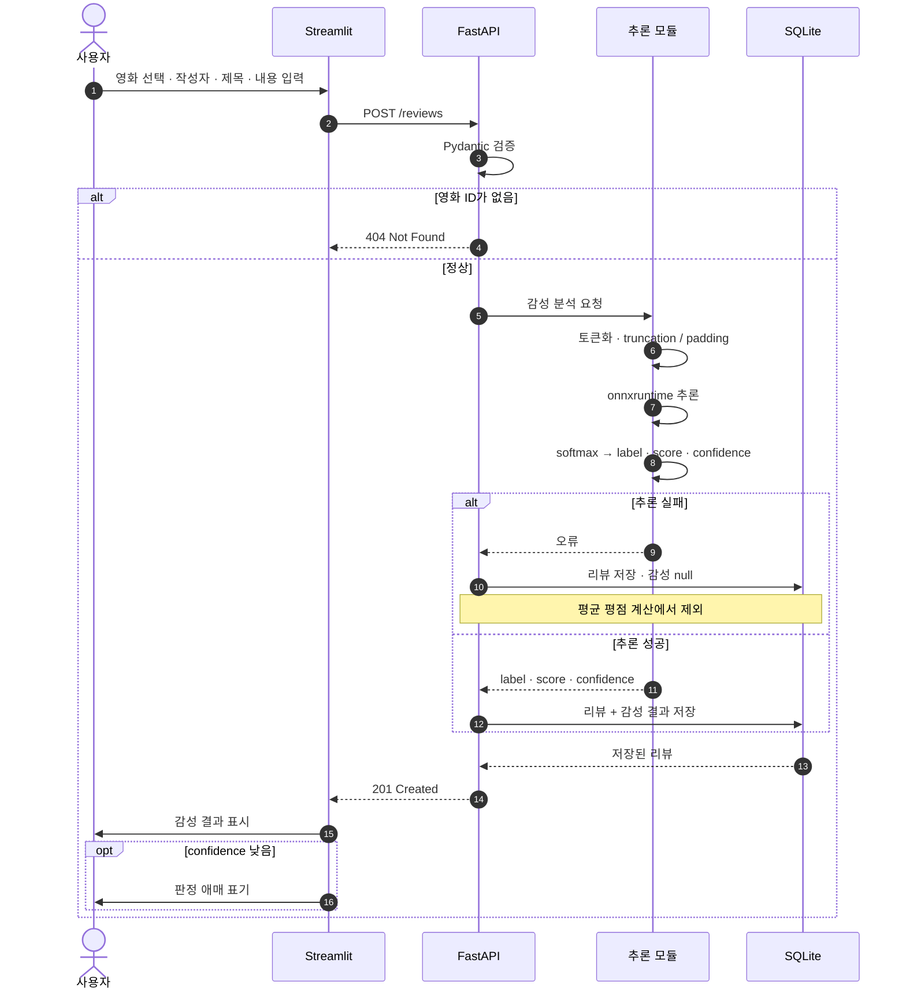
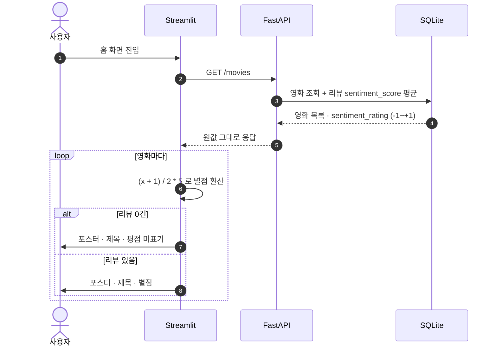
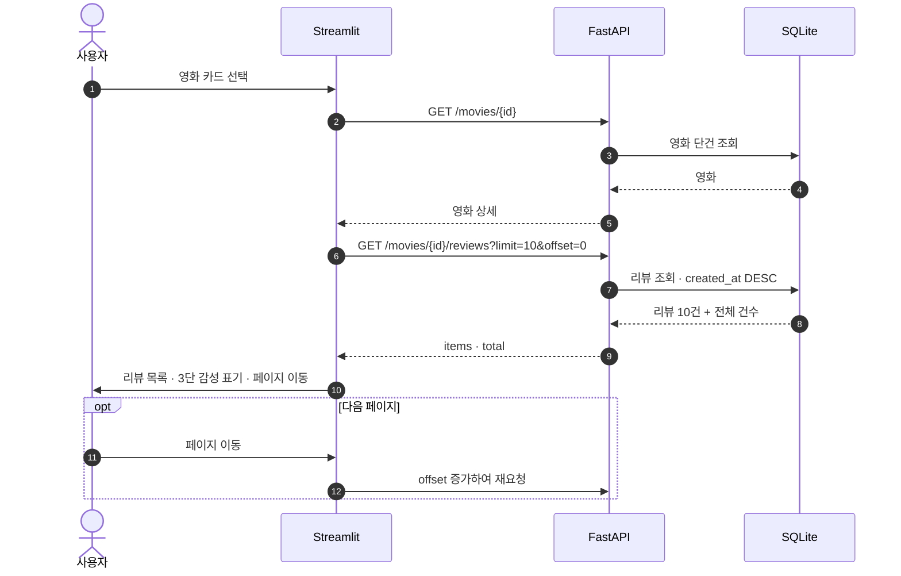
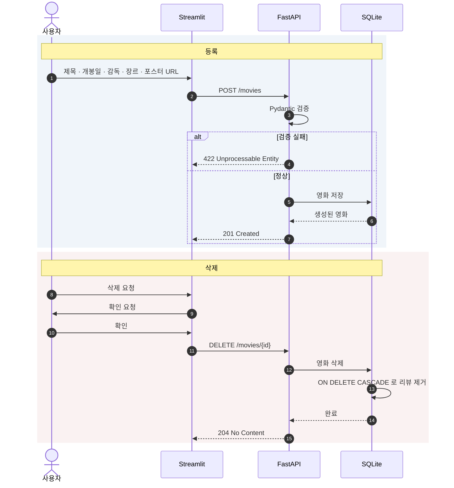
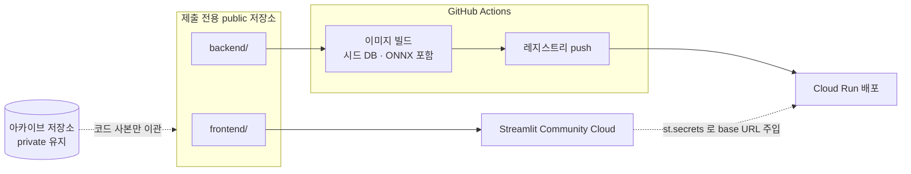

# 미션 18 구조도

보고서 제출 항목인 **서비스 구조도 · ERD · 주요 흐름**을 mermaid로 정리한 문서다.
설계 근거는 [CLAUDE.md](../../CLAUDE.md), 설계 내용은 [mission-concept.md](../draft/mission-concept.md)를 본다.

## A. 시스템 구성

### A-a. 전체 구성

수집은 로컬에서 1회만 수행하고, 그 결과인 시드 DB를 이미지에 굽는다.
따라서 **런타임에는 TMDB API 키가 필요 없고 외부 데이터 소스에 접근하지 않는다.**

**핵심 제약**: 모든 데이터는 백엔드가 소유한다. Streamlit은 화면만 담당하며
로컬 파일·세션 영속화 등 별도 저장 기능을 두지 않는다.

### A-b. 백엔드 내부 구성

추론 모듈을 서비스 계층에서 분리하는 이유는 모델 교체·성능 측정 시
라우터와 DB 접근 코드를 건드리지 않기 위해서다.

## B. 데이터 모델 (ERD)

### B-a. 저장되지 않는 값

`sentiment_rating`(영화 평점)은 **컬럼이 아니라 파생값**이다.
소속 리뷰 `sentiment_score`의 산술평균이며 범위는 `-1 ~ +1`이다.
캐시 컬럼으로 둘지 매 조회 시 집계할지는 미정이다(`PROJECT_PLAN.md` C-a-4).

`external_rating`과 혼동하지 않는다. 두 값은 출처도 범위도 다른 별개 필드다.

## C. 주요 흐름

### C-a. 리뷰 등록 — 감성 분석 포함

추론은 **등록 시 1회**만 수행하고 결과를 저장한다.
조회할 때마다 추론하면 목록 10건당 10회 추론이 발생한다.

### C-b. 영화 목록 조회 — 평점 환산

별점 환산은 **표현 계층에서만** 수행한다. DB와 API 응답은 `-1 ~ +1` 원값을 유지한다.

### C-c. 영화 상세와 리뷰 페이지네이션

리뷰 목록은 10개 단위이며 정렬 기준은 `created_at` 내림차순이다.
총 페이지 수를 계산해야 하므로 전체 건수를 함께 반환한다.

### C-d. 영화 등록과 삭제

삭제는 리뷰까지 연쇄 제거되므로 되돌릴 수 없다. 화면에서 확인 단계를 둔다.

## D. 배포 흐름

아카이브 저장소는 private을 유지하고, 제출 코드만 담은 별도 public 저장소를 통해 배포한다.

`mission14/gemini.key`가 아카이브 트리에 존재하므로 아카이브 저장소를 public으로
전환하지 않는다. TMDB 키는 준비 단계에서만 쓰고 이미지·저장소에 남기지 않는다.
