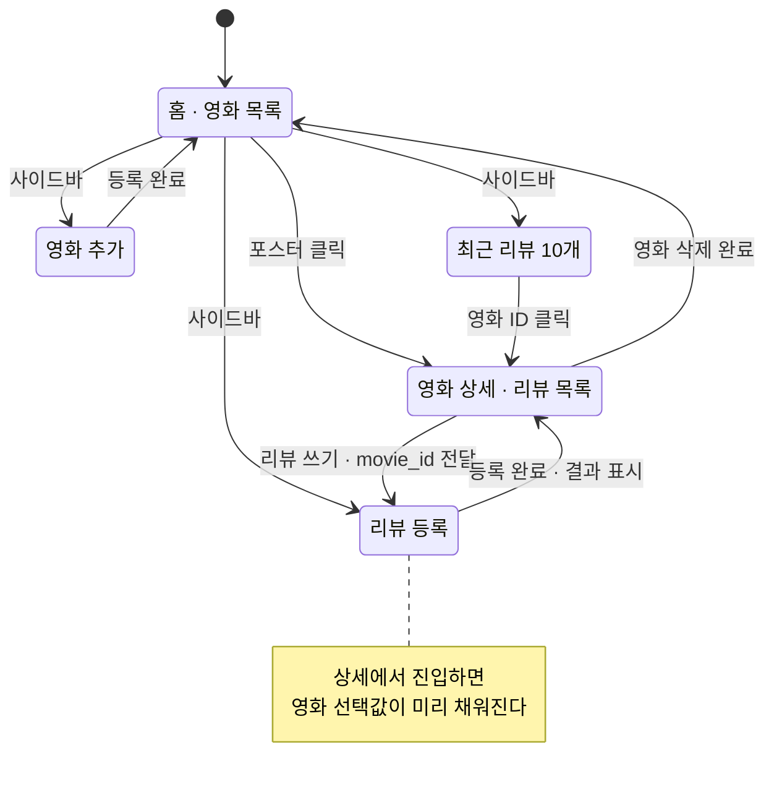

# 미션 18 화면 레이아웃

Streamlit 프론트엔드의 화면 구성이다. 설계 근거는 [CLAUDE.md](../../CLAUDE.md),
시스템 구조는 [architecture.md](architecture.md)를 본다.

## A. 구성 원칙

### A-a. 화면은 상태를 갖지 않는다

모든 데이터는 백엔드가 소유한다. 화면은 조회 결과를 그리고 입력을 전달할 뿐,
로컬 파일이나 세션에 데이터를 영속화하지 않는다. `st.session_state`는
**입력 중인 폼 값과 현재 페이지 번호 같은 휘발성 UI 상태에만** 쓴다.

### A-b. 별점 환산은 화면에서만 한다

API는 `-1 ~ +1` 원값을 준다. 별점은 화면에서 `(x + 1) / 2 * 5`로 환산해 그린다.
환산 결과를 백엔드로 되돌려 보내지 않는다.

### A-c. 화면 식별은 URL 쿼리 파라미터로 한다

영화 상세는 `?movie_id=12` 형태로 식별한다. `st.session_state`에만 담으면
새로고침 시 어떤 영화를 보고 있었는지 잃고, 캡처·공유도 어렵다.
제출물에 **동작 캡처**가 포함되므로 화면 상태가 URL에 남는 편이 유리하다.

## B. 네비게이션 구조



### B-a. 리뷰 등록을 독립 화면으로 둔 이유

가이드의 `심화` 요건은 "**저장된 영화 선택** · 작성자 이름 · 리뷰 내용 입력"이다.
상세 화면 인라인 폼만 두면 영화 선택 UI가 없어 요건 충족이 애매해진다.
그렇다고 인라인 폼과 독립 화면을 모두 만들면 같은 폼이 두 벌이 된다.

→ **독립 화면 하나만 두고, 상세에서 진입할 때 영화 선택값을 미리 채운다.**
요건(선택 UI 존재)과 동선(이미 고른 영화에 바로 쓰기)을 한 화면으로 만족한다.

## C. 공통 요소

### C-a. 사이드바

```
┌────────────────────┐
│  영화 리뷰 감성 분석  │
│                    │
│  ▸ 영화 목록        │
│    영화 추가        │
│    리뷰 등록        │
│    최근 리뷰        │
│                    │
│  ────────────────  │
│  데이터 출처         │
│  TMDB API          │
│  이 서비스는 TMDB    │
│  API를 사용하지만    │
│  TMDB가 보증하지     │
│  않습니다.          │
└────────────────────┘
```

TMDB 출처 표기는 약관상 의무다. 모든 화면에 노출되도록 사이드바에 고정한다.

### C-b. 감성 배지

| 라벨 | 표기 | 색 |
|---|---|---|
| 긍정 | `좋아요` | 초록 |
| 중립 | `보통` | 회색 |
| 부정 | `별로에요` | 빨강 |

`confidence`가 낮으면 보조 배지 `판정 애매`를 덧붙인다.
라벨을 감추거나 바꾸지 않는다 — 모델 판단은 그대로 두고 불확실성만 함께 알린다.

```
[ 좋아요 ]              ← 확신 있음
[ 보통 ] [ 판정 애매 ]   ← 저확신
```

### C-c. 별점

```
★★★★☆  4.1 / 5   (리뷰 12건)      ← sentiment_rating 0.64 를 환산
평점 없음            (리뷰 0건)      ← 리뷰가 없으면 별을 그리지 않는다
```

리뷰 0건일 때 별 0개를 그리면 "최악의 평가"로 오독된다. 문구로 구분한다.

### C-d. 포스터 대체 표시

`poster_url`이 없거나 로드에 실패하면 같은 크기의 회색 박스에 제목을 넣는다.
레이아웃이 무너지지 않도록 **크기는 정상 포스터와 동일하게** 유지한다.

```
┌──────────┐        ┌──────────┐
│          │        │▒▒▒▒▒▒▒▒▒▒│
│  포스터   │   →    │▒ 이미지 ▒│
│          │        │▒  없음  ▒│
└──────────┘        └──────────┘
```

### C-e. 백엔드 오류 배너

```
┌────────────────────────────────────────────────────────┐
│ ⚠  백엔드에 연결할 수 없습니다.                          │
│    잠시 후 다시 시도해 주세요. (연결 시간 초과)           │
└────────────────────────────────────────────────────────┘
```

Cloud Run은 유휴 시 인스턴스를 내리므로 첫 요청이 느릴 수 있다.
타임아웃을 넉넉히 잡고, 실패 시 빈 화면 대신 위 배너를 띄운다.

## D. 화면별 레이아웃

### D-a. 홈 · 영화 목록

```
┌──────────────┬──────────────────────────────────────────────────────────┐
│              │  영화 목록                                     [+ 영화 추가]│
│ ▸ 영화 목록   │                                                          │
│   영화 추가   │  ┌──────────┐  ┌──────────┐  ┌──────────┐  ┌──────────┐ │
│   리뷰 등록   │  │          │  │          │  │          │  │▒▒▒▒▒▒▒▒▒▒│ │
│   최근 리뷰   │  │  포스터   │  │  포스터   │  │  포스터   │  │▒ 이미지 ▒│ │
│              │  │  2 : 3   │  │          │  │          │  │▒  없음  ▒│ │
│ ──────────── │  └──────────┘  └──────────┘  └──────────┘  └──────────┘ │
│ 데이터 출처   │   기생충        괴물          헤어질 결심     범죄도시      │
│ TMDB API     │   ★★★★☆ 4.1   ★★★☆☆ 3.2    ★★★★☆ 4.4    평점 없음    │
│              │   리뷰 12건     리뷰 10건     리뷰 11건      리뷰 0건      │
│              │                                                          │
│              │  ┌──────────┐  ┌──────────┐                             │
│              │  │  포스터   │  │  포스터   │                             │
│              │  └──────────┘  └──────────┘                             │
│              │   ...                                                    │
└──────────────┴──────────────────────────────────────────────────────────┘
```

- 4열 그리드. 포스터는 2:3 비율로 통일해 카드 높이를 맞춘다.
- **제목은 포스터 바로 아래 병기**한다 — 포스터만으로는 영화를 특정하기 어렵다.
- 카드 전체가 상세 화면 진입점이다(`?movie_id=`).
- 평균 평점은 필수 요건상 **목록에서 바로 보여야** 한다.

### D-b. 영화 추가

```
┌──────────────┬──────────────────────────────────────────────────────────┐
│              │  영화 추가                                                │
│   영화 목록   │                                                          │
│ ▸ 영화 추가   │  제목 *                                                   │
│   리뷰 등록   │  ┌────────────────────────────────────────────────────┐ │
│   최근 리뷰   │  │                                                    │ │
│              │  └────────────────────────────────────────────────────┘ │
│              │                                                          │
│              │  개봉일 *              감독                                │
│              │  ┌──────────────┐    ┌──────────────────────────────┐   │
│              │  │ 2019-05-30 📅│    │                              │   │
│              │  └──────────────┘    └──────────────────────────────┘   │
│              │                                                          │
│              │  장르                  포스터 URL                          │
│              │  ┌──────────────┐    ┌──────────────────────────────┐   │
│              │  │ 드라마        │    │ https://image.tmdb.org/...   │   │
│              │  └──────────────┘    └──────────────────────────────┘   │
│              │                                                          │
│              │  ┌────── 미리보기 ──────┐                                 │
│              │  │                      │   URL을 입력하면 포스터를        │
│              │  │      포스터 미리보기   │   즉시 확인할 수 있다            │
│              │  └──────────────────────┘                                │
│              │                                                          │
│              │                          [ 취소 ]  [ 등록 ]               │
└──────────────┴──────────────────────────────────────────────────────────┘
```

- `st.form`으로 묶어 입력 중 rerun이 발생해도 값이 날아가지 않게 한다.
- **포스터 미리보기**를 둔다. URL 오타는 등록 후 목록에서야 드러나는데,
  그때는 이미 잘못된 데이터가 DB에 들어간 뒤다.
- 검증 실패(422) 시 어떤 필드가 문제인지 폼 위에 표시한다.

### D-c. 영화 상세 · 리뷰 목록

```
┌──────────────┬──────────────────────────────────────────────────────────┐
│              │  ← 목록으로                                               │
│ ▸ 영화 목록   │                                                          │
│   영화 추가   │  ┌──────────┐   기생충                                   │
│   리뷰 등록   │  │          │   2019-05-30 · 봉준호 · 드라마              │
│   최근 리뷰   │  │  포스터   │                                           │
│              │  │          │   감성 평점  ★★★★☆ 4.1 / 5  (리뷰 12건)     │
│              │  │          │   TMDB 평점  8.5 / 10                      │
│              │  └──────────┘                                            │
│              │                                          [ 리뷰 쓰기 ]    │
│              │  ──────────────────────────────────────────────────────  │
│              │  리뷰 12건                                                │
│              │                                                          │
│              │  ┌────────────────────────────────────────────────────┐ │
│              │  │ 연출이 정말 좋았다              [ 좋아요 ]           │ │
│              │  │ 익명1 · 2026-07-20 14:03                           │ │
│              │  │ 계단 구도만으로 계급을 설명하는 장면이 인상적이었다.   │ │
│              │  └────────────────────────────────────────────────────┘ │
│              │  ┌────────────────────────────────────────────────────┐ │
│              │  │ 그냥 그랬음               [ 보통 ] [ 판정 애매 ]     │ │
│              │  │ 익명2 · 2026-07-20 13:51                           │ │
│              │  │ 기대가 커서였는지 생각보다는...                       │ │
│              │  └────────────────────────────────────────────────────┘ │
│              │                          ...                             │
│              │                                                          │
│              │        [ ‹ 이전 ]   2 / 2 페이지   [ 다음 › ]             │
│              │  ──────────────────────────────────────────────────────  │
│              │  ⚠ 위험 구역                                             │
│              │  이 영화를 삭제하면 리뷰 12건도 함께 삭제됩니다.            │
│              │  □ 위 내용을 이해했습니다          [ 영화 삭제 ]           │
└──────────────┴──────────────────────────────────────────────────────────┘
```

- **평점 2종을 나란히, 이름을 붙여 표시**한다. `external_rating`(TMDB, 0~10)과
  `sentiment_rating`(감성 평균, 별점 환산)은 성격이 달라 섞이면 오독된다.
- 리뷰 카드는 제목 · 감성 배지 · 작성자 · 등록일 · 내용 순.
- 페이지네이션은 10개 단위, `created_at` 내림차순. 총 페이지 수를 함께 표시한다.
- **삭제는 되돌릴 수 없다**(리뷰 연쇄 삭제). 체크박스를 켜야 버튼이 활성화되는
  2단계 확인을 두고, 화면 최하단에 배치해 오조작을 줄인다.

### D-d. 리뷰 등록

```
┌──────────────┬──────────────────────────────────────────────────────────┐
│              │  리뷰 등록                                                │
│   영화 목록   │                                                          │
│   영화 추가   │  영화 *                                                   │
│ ▸ 리뷰 등록   │  ┌────────────────────────────────────────────────┐     │
│   최근 리뷰   │  │ 기생충 (2019)                              ▾   │     │
│              │  └────────────────────────────────────────────────┘     │
│              │   상세 화면에서 들어오면 미리 선택되어 있다                  │
│              │                                                          │
│              │  작성자 *                                                 │
│              │  ┌──────────────────────────┐                           │
│              │  │                          │                           │
│              │  └──────────────────────────┘                           │
│              │                                                          │
│              │  제목                                                     │
│              │  ┌────────────────────────────────────────────────┐     │
│              │  └────────────────────────────────────────────────┘     │
│              │                                                          │
│              │  내용 *                                                   │
│              │  ┌────────────────────────────────────────────────┐     │
│              │  │                                                │     │
│              │  │                                                │     │
│              │  └────────────────────────────────────────────────┘     │
│              │                                        [ 등록 ]          │
│              │  ──────────────────────────────────────────────────────  │
│              │  ┌────────────────────────────────────────────────────┐ │
│              │  │  감성 분석 결과                                      │ │
│              │  │                                                    │ │
│              │  │      [ 좋아요 ]        확신도 0.92                   │ │
│              │  │                                                    │ │
│              │  │  이 리뷰는 기생충의 평점에 반영되었습니다.             │ │
│              │  │                          [ 영화 상세로 이동 ]        │ │
│              │  └────────────────────────────────────────────────────┘ │
└──────────────┴──────────────────────────────────────────────────────────┘
```

- 등록 직후 **같은 화면에서 감성 분석 결과를 보여준다**. 가이드의
  "리뷰 작성 후 자동 실행 · 결과 표시" 요건이 여기서 충족된다.
- 결과 카드에 `confidence`를 수치로 노출한다. 저확신이면 `판정 애매` 배지가 붙는다.
- 추론이 실패하면 결과 카드 자리에 안내를 띄운다 —
  "리뷰는 저장되었으나 감성 분석에 실패했습니다. 평점에는 반영되지 않습니다."

### D-e. 최근 리뷰

```
┌──────────────┬──────────────────────────────────────────────────────────┐
│              │  최근 리뷰 10개                                           │
│   영화 목록   │                                                          │
│   영화 추가   │  ┌──────┬────────────────┬──────────────────┬────────┐  │
│   리뷰 등록   │  │ 영화 │ 등록일          │ 리뷰 내용         │ 감성    │  │
│ ▸ 최근 리뷰   │  ├──────┼────────────────┼──────────────────┼────────┤  │
│              │  │  12  │ 07-20 14:03    │ 계단 구도만으로... │ 좋아요  │  │
│              │  │  12  │ 07-20 13:51    │ 기대가 커서였는지  │ 보통 ⚠ │  │
│              │  │   7  │ 07-20 13:44    │ 시간이 아까웠다    │ 별로에요│  │
│              │  │  ...                                              │  │
│              │  └──────┴────────────────┴──────────────────┴────────┘  │
│              │                                                          │
│              │  영화 ID를 누르면 해당 영화 상세로 이동합니다.               │
└──────────────┴──────────────────────────────────────────────────────────┘
```

- 표시 항목은 가이드가 지정한 **영화 ID · 등록일 · 리뷰 내용 · 감성 분석 결과** 4종이다.
  임의로 늘리거나 줄이지 않는다.
- 긴 리뷰는 말줄임 처리하고, 전체 내용은 상세 화면에서 본다.
- `⚠`는 저확신 표시다. 표 안에서는 배지 두 개가 좁으므로 기호로 압축한다.

## E. 구현 시 유의점

### E-a. Streamlit 특성

- 위젯을 건드릴 때마다 스크립트가 처음부터 다시 실행된다. 입력 폼은 `st.form`으로
  묶어 **제출 시점에만** 백엔드를 호출한다. 그렇지 않으면 타자 한 글자마다 요청이 나간다.
- 목록 조회 결과는 짧게 캐시해도 되지만, **등록·삭제 직후에는 반드시 캐시를 무효화**한다.
  방금 추가한 영화가 목록에 안 보이면 저장 실패로 오해한다.
- 페이지 번호는 `st.session_state`, 영화 식별은 `st.query_params`로 나눠 관리한다(A-c).

### E-b. 화면과 백엔드의 경계

- 별점 환산, 말줄임, 배지 색 결정은 전부 화면 쪽 책임이다.
- 정렬·페이지 나누기는 백엔드 책임이다. 전체 리뷰를 받아 화면에서 자르지 않는다.
- 화면이 감성 라벨을 스스로 판정하는 코드는 두지 않는다. 백엔드가 준 값만 그린다.
