# 미션 18 — 영화 리뷰 감성 분석 웹 서비스

**3팀 신호정** · 코드잇 K-DT AI 엔지니어 10기

Streamlit(프론트엔드) · FastAPI(백엔드) · ONNX 모델 서빙을 하나의 서비스로 통합한
3-tier 웹 애플리케이션이다.

---

## A. 서비스 개요

### A-a. 목적

영화 정보를 관리하고, 사용자가 남긴 리뷰의 감성을 자동 분석해 **영화 평점으로 환산**하는 서비스다.
스프린트의 마지막 미션으로, 앞선 미션에서 따로 다뤘던 세 영역을 하나로 합치는 데 목적이 있다.

- 미션 17: Streamlit 단일 앱 + ONNX 추론
- **미션 18: 백엔드 분리 · DB · REST API가 더해진 3-tier 구성**

핵심 제약은 **모든 데이터를 백엔드가 소유한다**는 것이다. Streamlit 쪽에는 로컬 파일이나
세션 영속화 같은 별도 저장 기능을 두지 않았다.

### A-b. 기능

가이드가 구분한 필수 / `심화` 경계를 그대로 따랐다.

| 구분 | 프론트엔드 (Streamlit) | 백엔드 (FastAPI) |
|---|---|---|
| **필수** | 영화 목록(제목·포스터·평균 평점), 영화 추가 폼 | 영화 등록 / 전체·단건 조회 / 삭제 |
| **`심화`** | 리뷰 등록, 감성 분석 결과 표시, 최근 10개 리뷰 | 리뷰 CRUD, 평점 조회(감성 점수 평균), 감성 분석 |

### A-c. 기술 스택

| 계층 | 사용 기술 | 선택 이유 |
|---|---|---|
| 프론트엔드 | Streamlit 1.55 | 가이드 지정. 화면만 담당하고 상태를 갖지 않는다 |
| 백엔드 | FastAPI 0.115 + SQLAlchemy 2.0 | OpenAPI 문서 자동 생성이 제출 항목과 직결된다 |
| DB | SQLite | 단일 인스턴스 데모 규모에 충분하고 별도 서버가 필요 없다 |
| 모델 서빙 | onnxruntime 1.28 + tokenizers 0.23 | `transformers` 없이 추론 — 메모리 예산에 직접 영향 |
| 컨테이너 | python:3.12-slim | Cloud Run 배포 대상 |

### A-d. 감성 스칼라와 평점 환산

감성 라벨을 **부정 -1 · 중립 0 · 긍정 +1** 스칼라로 두고, 영화 평점은 소속 리뷰 스칼라의
산술평균(-1 ~ +1)으로 정의했다. 화면에는 `(x + 1) / 2 * 5`로 **0~5 별점으로 환산해서만**
표시하며, DB와 API 응답은 원값을 유지한다.

**리뷰가 없으면 평점은 `null`이다.** 0으로 바꾸지 않았다 — 0은 이미 '중립'이라는 의미를
갖고 있어서 리뷰 없음과 중립 평가가 구분되지 않기 때문이다. 화면에는 `평점 없음`으로 적는다.

---

## B. 서비스 구조도

### B-a. 전체 구성

데이터 수집은 **로컬에서 1회만** 수행하고 그 결과인 시드 DB를 이미지에 굽는다.
따라서 런타임에는 TMDB API 키가 필요 없고 외부 데이터 소스에 접근하지 않는다.

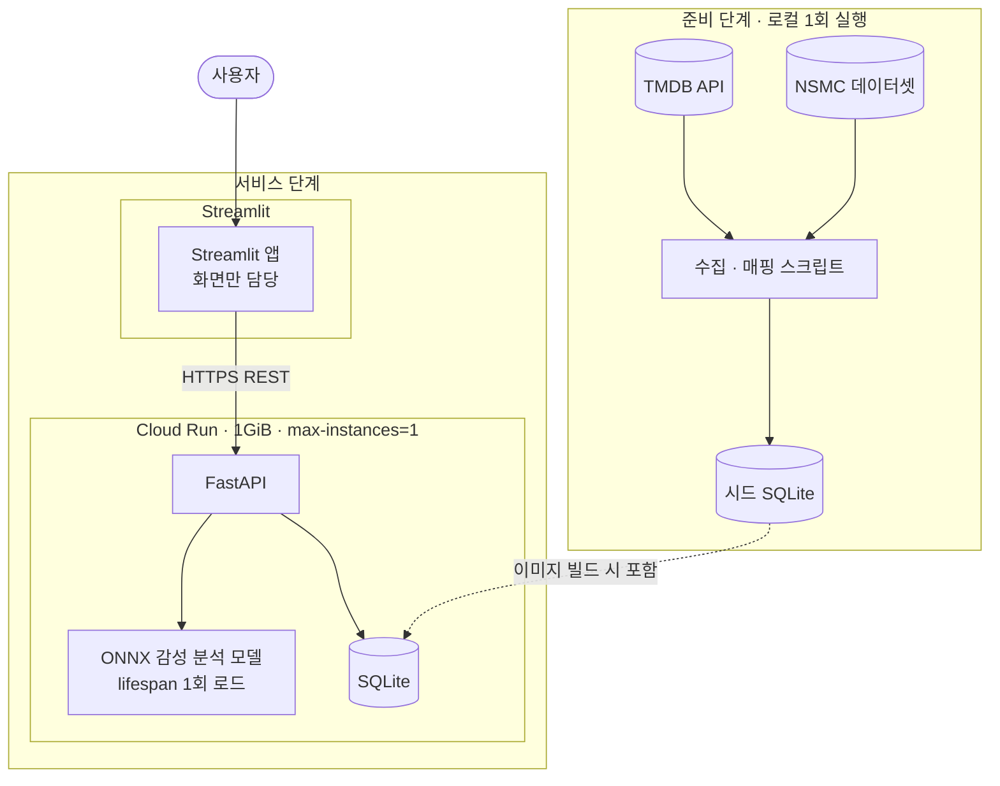

### B-b. 백엔드 내부 구성

추론 모듈을 서비스 계층에서 분리한 이유는, 모델을 교체하거나 성능을 측정할 때
라우터와 DB 접근 코드를 건드리지 않기 위해서다.

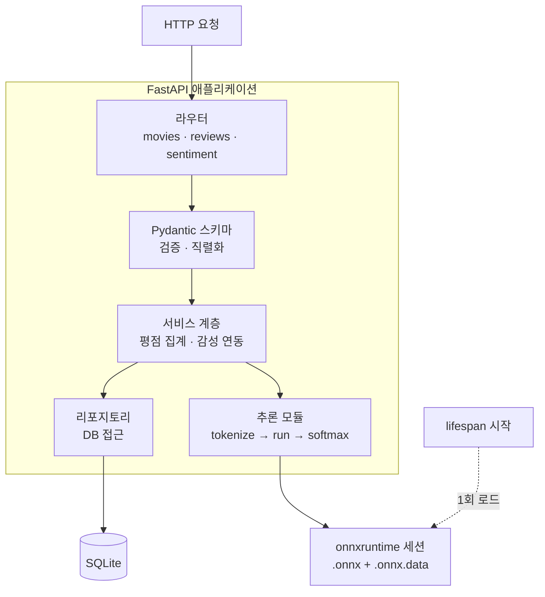

### B-c. 주요 흐름 — 리뷰 등록과 감성 분석

추론은 **등록 시 1회**만 수행하고 결과를 저장한다. 조회할 때마다 추론하면
리뷰 10건 페이지에서 10회 추론이 발생하고, 실측 기준 800ms대 지연이 된다.

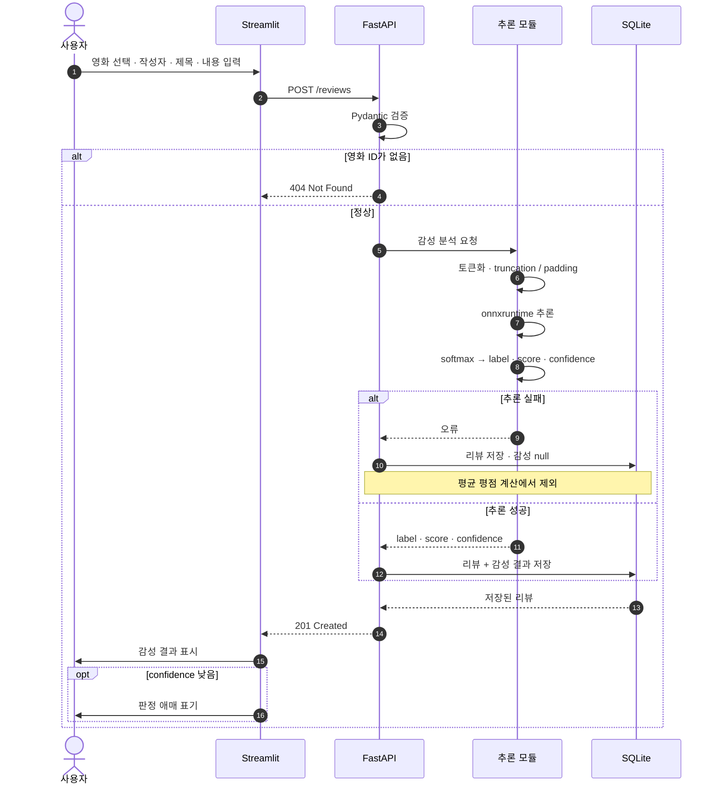

추론이 실패해도 **201을 반환한다.** 리뷰 저장 자체는 성공했기 때문이다.
이때 감성 필드만 `null`이 되고, `AVG`가 NULL 행을 건너뛰므로 평균 평점이 오염되지 않는다.

---

## C. 데이터베이스 구조도 (ERD)

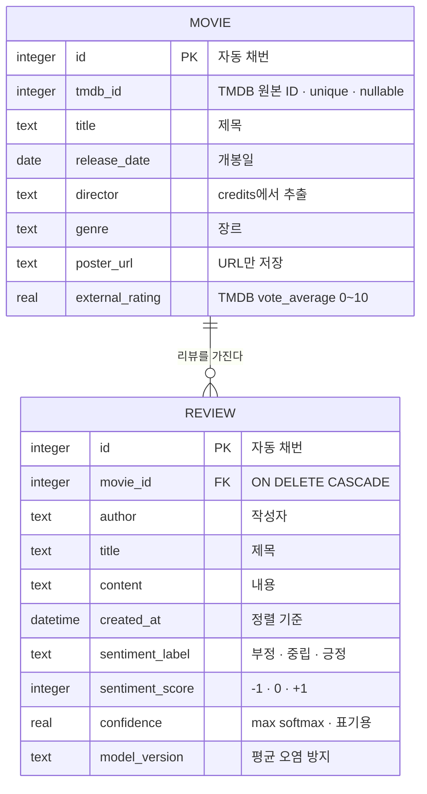

### C-a. 평점 필드를 둘로 나눈 이유

`external_rating`(TMDB 수집값, 0~10)과 `sentiment_rating`(리뷰 감성 평균, -1~+1)은
**출처도 범위도 다른 별개의 값**이다. 한 컬럼에 담으면 한쪽이 다른 쪽을 덮어쓴다.
화면에서도 이름을 붙여 나란히 보여준다.

`sentiment_rating`은 **컬럼이 아니라 파생값**이다. 캐시 컬럼으로 두면 리뷰 등록 · 리뷰 삭제 ·
영화 삭제 세 경로에서 갱신해야 하고, 한 곳만 빠뜨려도 화면의 평점이 조용히 틀어진다.
현재 규모(리뷰 72건)에서는 `LEFT JOIN` + `AVG` 한 번으로 충분하며, 실측 조회 지연은 3.8ms다.

### C-b. 삭제와 무결성

영화 삭제 시 리뷰는 FK의 `ON DELETE CASCADE`로 **DB가 함께 지운다.** 애플리케이션 코드로
리뷰를 먼저 지우고 영화를 지우면 중간 실패 시 고아 데이터가 남는다.

주의할 점은 **SQLite가 외래 키 제약을 기본으로 끄고 있다**는 것이다. 연결마다
`PRAGMA foreign_keys=ON`을 실행하지 않으면 CASCADE가 조용히 무시되고 테스트에서도
통과해 버린다. 연결 이벤트에 PRAGMA를 걸고, 연쇄 삭제를 테스트로 고정했다.

### C-c. 중복 방지

- `tmdb_id`에 UNIQUE. 단 nullable이다 — 화면에서 수동 등록한 영화에는 TMDB ID가 없다.
- `(title, release_date)` 복합 UNIQUE. 같은 제목의 리메이크는 개봉일이 달라 통과한다.

---

## D. API 명세

### D-a. 엔드포인트

| 메서드 | 경로 | 설명 | 성공 |
|---|---|---|---|
| GET | `/health` | 헬스 체크 · 모델 로드 여부 | 200 |
| GET | `/movies` | 영화 목록 (평균 평점 · 리뷰 수 포함) | 200 |
| POST | `/movies` | 영화 등록 | 201 |
| GET | `/movies/{movie_id}` | 영화 단건 조회 | 200 |
| DELETE | `/movies/{movie_id}` | 영화 삭제 (리뷰 연쇄 삭제) | 204 |
| GET | `/movies/{movie_id}/reviews` | 영화별 리뷰 (페이지네이션) | 200 |
| GET | `/movies/{movie_id}/rating` | 평점 조회 (감성 점수 평균) | 200 |
| POST | `/reviews` | 리뷰 등록 (감성 분석 자동 실행) | 201 |
| GET | `/reviews` | 전체 리뷰 최신순 (페이지네이션) | 200 |
| DELETE | `/reviews/{review_id}` | 리뷰 삭제 | 204 |
| POST | `/sentiment/analyze` | 감성 분석만 수행 (저장 없음) | 200 |

`GET /reviews`가 "최근 10개 리뷰" 화면을 담당한다(`limit=10&offset=0`).
`POST /sentiment/analyze`는 저장 없이 모델만 호출해, 감성 분석 기능을 Swagger에서
직접 시연할 수 있게 한 엔드포인트다.

### D-b. 상태 코드와 예외 처리

| 코드 | 상황 |
|---|---|
| 404 | 존재하지 않는 `movie_id` · `review_id` |
| 409 | 중복 영화 (`tmdb_id` 또는 제목+개봉일 충돌) |
| 422 | Pydantic 검증 실패 |
| 503 | `/sentiment/analyze`에서 모델 미로드 · 추론 실패 |

**모델 로드에 실패해도 앱은 기동한다.** `/health`가 `model_loaded: false`를 보고하고,
리뷰 등록은 감성 `null`로 계속 동작한다. 영화 CRUD는 필수 기능이며 모델과 무관하므로
함께 막을 이유가 없다.

### D-c. 페이지네이션

```json
{ "items": [], "total": 42, "limit": 10, "offset": 0 }
```

총 페이지 수를 계산해야 하므로 `total`을 함께 반환한다. 정렬은 `created_at DESC, id DESC`로,
같은 초에 생성된 시드 리뷰의 순서를 고정하기 위해 `id`를 보조 키로 두었다.

### D-d. FastAPI Docs 전체 캡처

모든 엔드포인트에 `summary` · `description` · 응답 모델을 채웠다.
누락을 막기 위해 **OpenAPI 스펙을 순회하며 설명이 비어 있으면 실패하는 테스트**를 두었다.

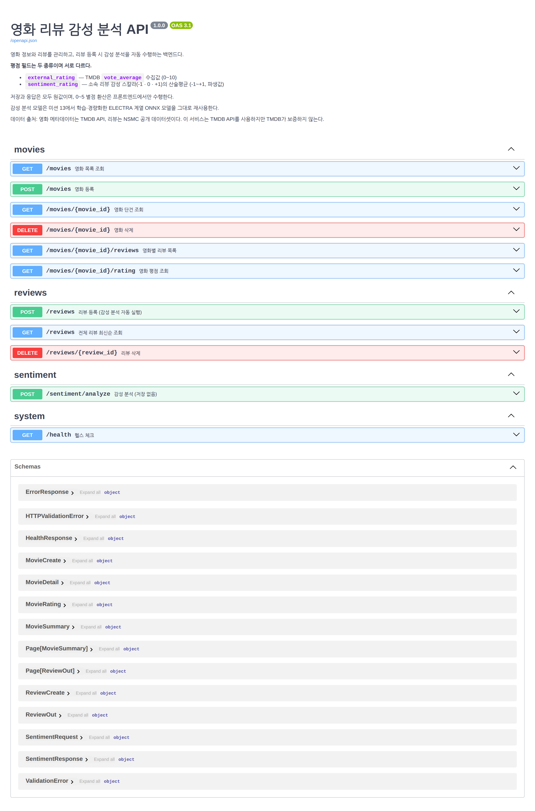

리뷰 등록 엔드포인트를 펼친 모습이다. 요청 스키마와 예시, 응답 모델이 함께 노출된다.

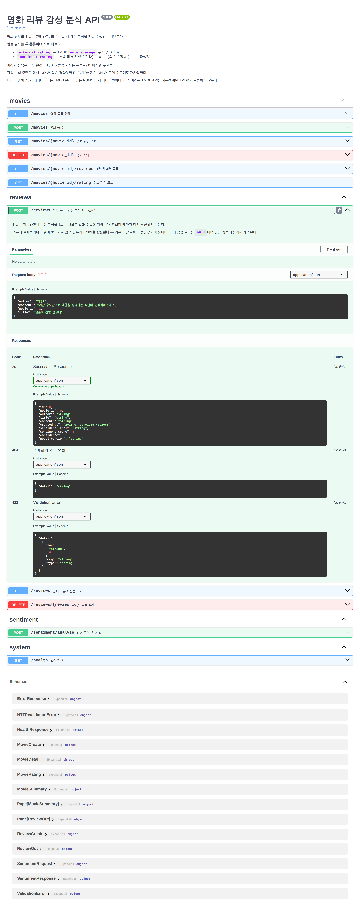

---

## E. 모델 서빙

### E-a. 미션 13 자산 재사용과 경량화

가이드는 "적절한 모델 리서치"와 "**모델 경량화 방식에 대한 고민**"을 요구한다.
미션 13에서 이미 한국어 감성 분석 모델을 학습하고 ONNX로 변환해 두었으므로,
**재학습 없이 그 자산을 그대로 재사용**했다.

미션 13에서 비교한 6개 조합의 결과가 이번 선택의 근거다.

| 조합 | ONNX 크기 | test F1 | test Acc | p50 |
|---|---|---|---|---|
| **KcELECTRA-small Full FT (선정)** | **63.3MB** | **0.856** | **0.885** | 29ms |
| KcELECTRA-small LoRA | 63.3MB | 0.843 | 0.874 | 32ms |
| KcELECTRA-small Freeze | 63.3MB | 0.624 | 0.713 | 28ms |
| KoMiniLM Full FT | 88.8MB | 0.869 | 0.897 | 28ms |
| KoMiniLM LoRA | 88.8MB | 0.847 | 0.877 | 34ms |
| KoMiniLM Freeze | 88.8MB | 0.745 | 0.802 | 30ms |

정확도만 보면 KoMiniLM Full FT가 가장 높지만 **크기가 40% 크다.** 경량화 관점에서
크기 기준을 먼저 통과시키고 그 안에서 정확도를 골랐다.

경량화를 위해 서빙 단계에서 추가로 택한 선택은 두 가지다.

1. **`transformers`를 설치하지 않는다.** 미션 13이 남긴 `tokenizer.json`은 Rust 구현체인
   `tokenizers` 패키지만으로 로드된다. `transformers`를 넣으면 의존성이 크게 늘고
   경우에 따라 torch까지 끌려온다. 실측 피크 메모리 168MiB는 이 선택의 결과다.
2. **세션은 `lifespan`에서 1회만 생성한다.** 요청마다 `InferenceSession`을 만들면
   모델 파일을 매번 다시 읽는다.

### E-b. 모델 사양과 라벨 매핑

| 항목 | 값 |
|---|---|
| 구조 | ELECTRA 계열, hidden 256 · 12 layers · vocab 54,343 |
| 파일 | `.onnx` 63MB + `.onnx.data` 63MB (external data, **짝이 맞아야 로드된다**) |
| 입력 | `input_ids` · `attention_mask` · `token_type_ids`, 각 `[1, 256]` **int32** |
| 출력 | `logits [1, 3]` — **raw logit**, softmax 미적용 |

`config.json`의 `id2label`은 `LABEL_0~2`뿐이라 의미를 담고 있지 않다.
**인덱스를 추측해 쓰면 평점의 부호가 통째로 뒤집힌다.** 아래 두 근거로 확정했다.

1. 미션 13 학습 코드의 `LABEL_MAP = {'-1': 0, '0': 1, '1': 2}`
2. 골든 케이스 9건 추론 실측 (8건 일치, 불일치 1건은 중립)

| 인덱스 | 감성 | 스칼라 | 화면 표기 |
|---|---|---|---|
| 0 | 부정 | -1 | `별로에요` |
| 1 | 중립 | 0 | `보통` |
| 2 | 긍정 | +1 | `좋아요` |

이 매핑은 회귀 테스트로 고정해 두었다.

### E-c. 도메인 이동에 따른 성능 변화

**미션 13의 학습 도메인은 쇼핑몰·SNS 리뷰인데, 이번 추론 대상은 영화 리뷰(NSMC)다.**
성능 저하 가능성이 있어 NSMC test 3,000건(SEED=42)으로 실측했다.

NSMC는 이진 라벨(0=부정 / 1=긍정)이고 **중립 정답이 없다.** 그래서 지표를 둘로 나눴다.

| 지표 | 값 |
|---|---|
| 미션 13 자체 도메인 test accuracy | 0.885 |
| **NSMC 이진 정확도** (중립 예측 제외, 2,400건) | **0.818** |
| 엄격 정확도 (중립 예측을 오답 처리) | 0.654 |
| 중립 예측 비율 | 0.200 |

| 정답 \ 예측 | 긍정 | 부정 | 중립 |
|---|---|---|---|
| 부정(0) | 134 | 1,123 | 257 |
| 긍정(1) | 840 | 303 | 343 |

- **약 7%p 하락했다.** 재학습 없이 자산을 재사용한 대가이며, 감추지 않고 그대로 싣는다.
- 엄격 정확도 0.654는 **과소평가된 수치다.** NSMC에 중립 정답이 없어 중립 예측 600건이
  전부 오답으로 계산된다. 중립 예측은 확신도가 낮은 구간에 몰려 있어(0.9 미만에서 40~55%)
  모델의 **판단 유보**로 보는 편이 타당하다.
- 부정 정답의 긍정 오분류(134건)보다 긍정 정답의 부정 오분류(303건)가 많다.
  **부정 쪽으로 치우친 예측 경향**이 있다.

### E-d. 저확신 예측 대응

`confidence`(= `max(softmax(logits))`) 구간별 정확도를 집계했다.

| confidence | 건수 | 엄격 정확도 | 이진 정확도 | 중립 예측 비율 |
|---|---|---|---|---|
| ~0.50 | 58 | 0.293 | 0.567 | 0.483 |
| 0.50~0.60 | 233 | 0.270 | 0.594 | 0.545 |
| 0.60~0.70 | 231 | 0.377 | 0.719 | 0.476 |
| 0.70~0.80 | 281 | 0.381 | 0.656 | 0.420 |
| 0.80~0.90 | 351 | 0.479 | 0.800 | 0.402 |
| 0.90~0.95 | 314 | 0.669 | 0.805 | 0.169 |
| **0.95~1.00** | **1,532** | **0.856** | **0.869** | 0.015 |

**confidence는 정확도와 단조에 가깝게 증가한다.** 따라서 이를 저확신 표기의 기준으로 삼는 것이
실측으로 정당화된다. 0.90 미만 구간은 엄격 정확도가 0.5를 밑돌므로 **임계값을 0.90**으로 정했다.

대응 방식은 **표기까지만** 한다. `confidence`로 예측을 보정하거나 뒤집지 않는다.
저확신이면 화면에 `판정 애매` 배지를 덧붙이되 라벨은 그대로 보여준다 —
모델의 판단을 감추지 않으면서 불확실성만 함께 전달하는 방법이고,
추가 의존성도 지연도 들지 않는다.

### E-e. 입력 길이 제약 (truncation)

모델은 **Fixed Shape**이라 입력이 256 토큰으로 고정된다. 긴 리뷰가 어떻게 처리되는지
직접 확인했다.

| 사례 | 앞 200자만 | 전체(700자+, 잘림) |
|---|---|---|
| 앞=긍정 / 뒤=부정 | 긍정 0.988 | 긍정 0.578 |
| 앞=부정 / 뒤=긍정 | 부정 0.987 | **긍정 0.500** |

모델은 앞 256토큰만 보므로 **뒤쪽의 반전 문장은 판단에 반영되지 않는다.**
다만 잘린 입력은 확신도가 0.50대로 급락해, 저확신 표기가 이 경우도 함께 걸러내는
부수 효과가 있다. 추론 결과에 `truncated` 플래그를 포함시켜 화면이 안내할 수 있게 했다.

---

## F. 서비스 동작 캡처

시드 데이터는 **영화 6편 · 리뷰 72건(영화당 12건)** 으로, 캡처 요건(영화 3편 이상 ·
영화당 리뷰 10건 이상)을 충족한다.

### F-a. 영화 목록

포스터 · 제목 · 평균 평점(별점 환산) · 리뷰 수를 함께 보여준다. 포스터만으로는 영화를
특정하기 어려워 제목을 바로 아래 병기했고, 카드 전체가 상세 화면 진입점이다.

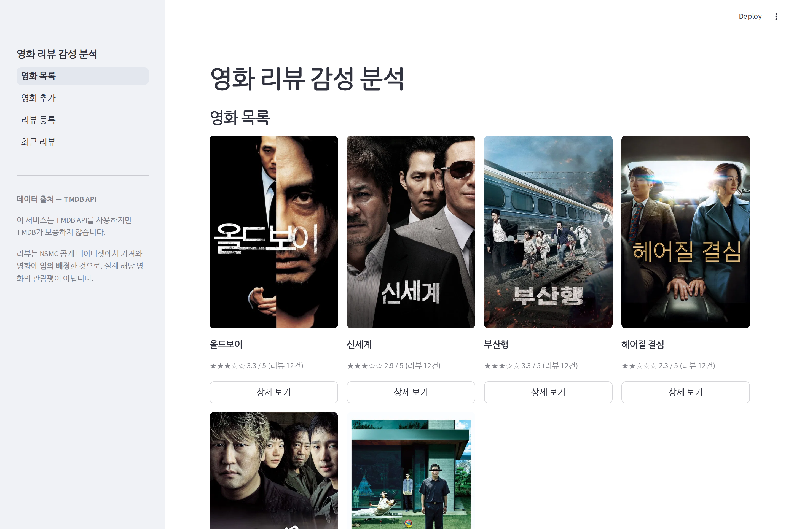

### F-b. 영화 상세와 리뷰 목록

평점 2종을 이름과 함께 나란히 표시한다. 리뷰 카드에는 감성 배지가 붙고,
확신도가 낮으면 `판정 애매`가 함께 붙는다.

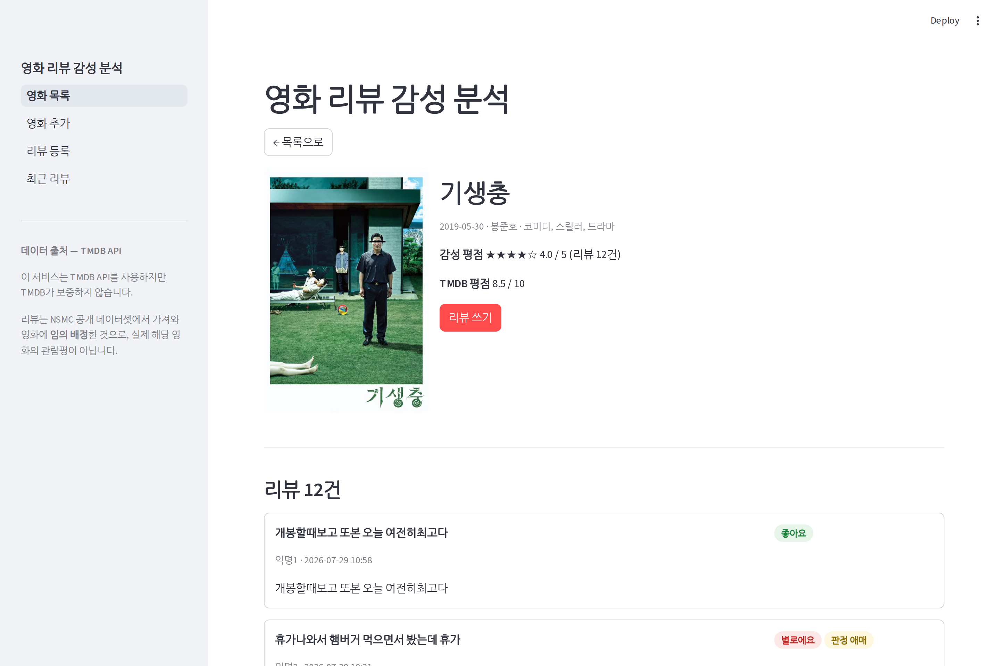

리뷰는 10건 단위로 나뉜다. 2페이지로 이동한 모습이다.

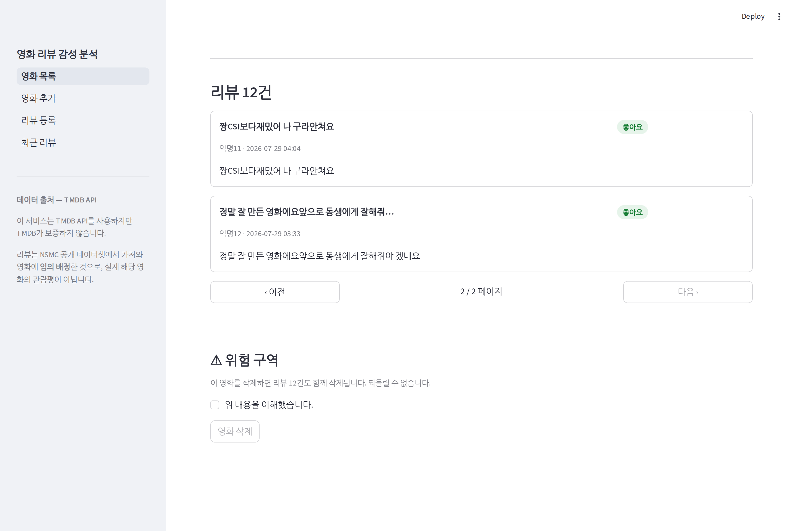

### F-c. 영화 추가

`st.form`으로 묶어 입력 중 rerun이 나도 값이 날아가지 않게 했다. 포스터 URL을 넣으면
즉시 미리보기가 뜬다 — 오타는 등록 후 목록에서야 드러나는데, 그때는 이미 잘못된 데이터가
DB에 들어간 뒤다.

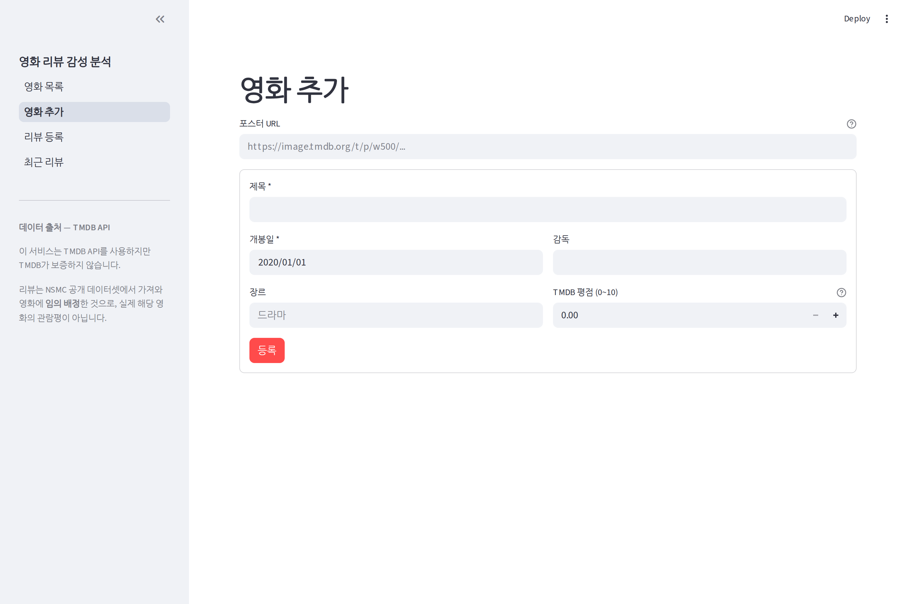

### F-d. 리뷰 등록과 감성 분석 결과

영화 선택 UI를 갖춘 독립 화면이며, 영화 상세에서 진입하면 해당 영화가 미리 선택된다.

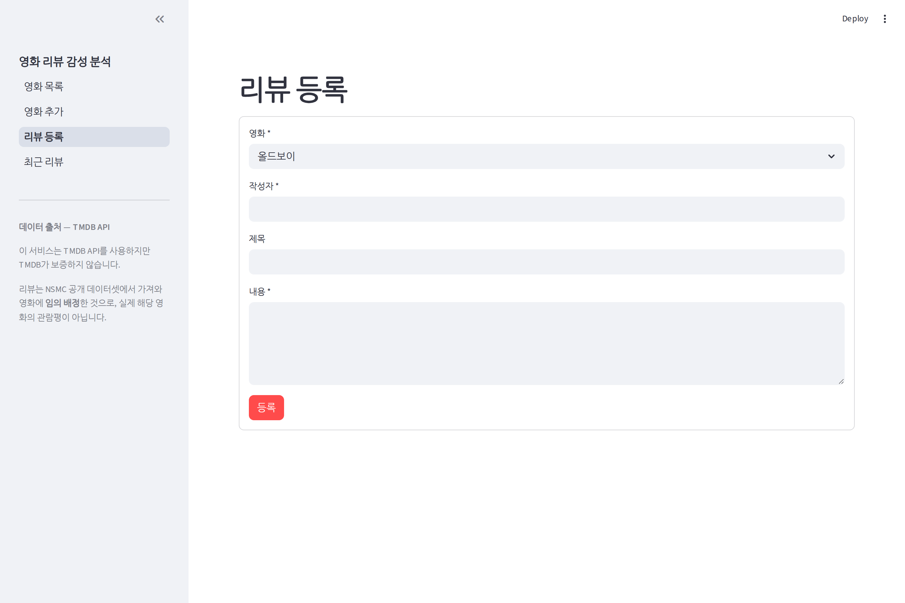

등록 직후 **같은 화면에서 감성 분석 결과를 보여준다.** 확신도를 수치로 함께 노출한다.

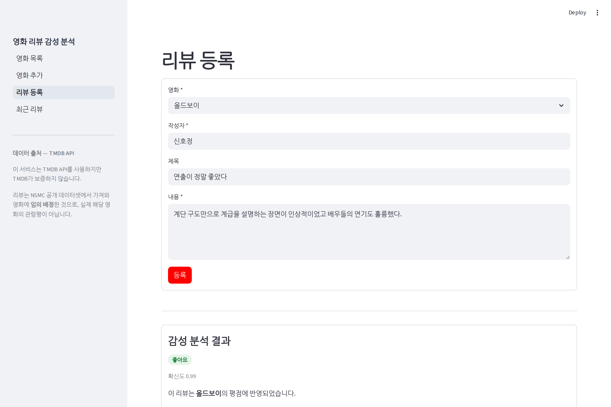

### F-e. 최근 리뷰 10개

표시 항목은 가이드가 지정한 **영화 ID · 등록일 · 리뷰 내용 · 감성 분석 결과** 4종이다.
표 안에서는 배지 두 개가 좁아 저확신을 `⚠` 기호로 압축했다.

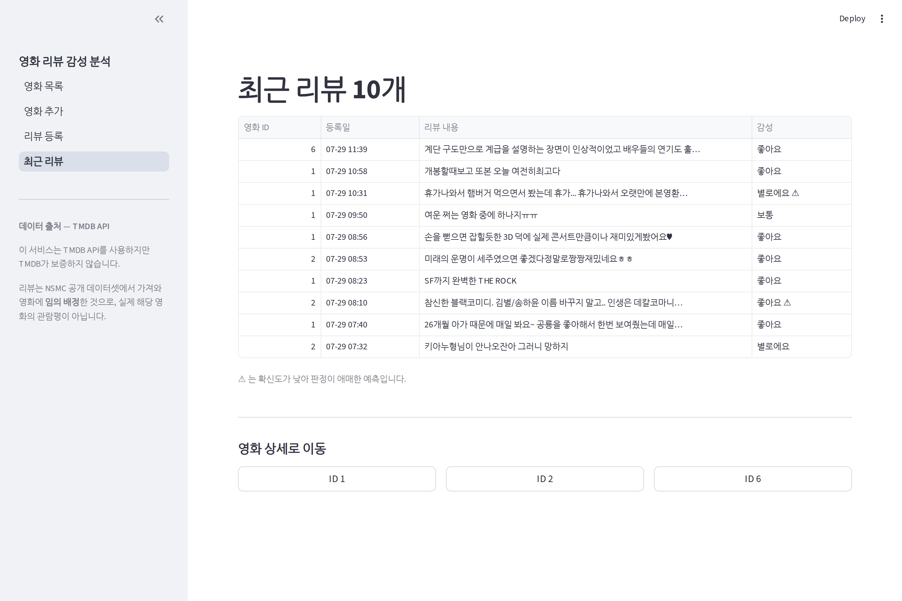

---

## G. 데이터 출처와 한계

### G-a. 영화 메타데이터 — TMDB API

**This product uses the TMDB API but is not endorsed or certified by TMDB.**
(이 서비스는 TMDB API를 사용하지만 TMDB가 보증하지 않습니다.)

출처 표기는 약관상 의무이므로 모든 화면에 노출되도록 사이드바에 고정했다.

감독은 `/movie/{id}` 응답에 없어 `/movie/{id}/credits`의 `crew`에서 `job == "Director"`로
따로 추출했다. 포스터는 **URL만 저장**하고 이미지 파일을 저장소에 복사하지 않았다.

### G-b. 리뷰 — NSMC, 그리고 임의 배정이라는 한계

리뷰는 **NSMC**(네이버 영화 리뷰 20만 건) 공개 데이터셋에서 가져왔다.

> ⚠ **리뷰와 영화의 대응은 임의 배정이며, 실제 해당 영화의 관람평이 아니다.**

NSMC는 영화별로 정리된 데이터가 아니라 리뷰 텍스트와 긍/부정 라벨의 모음이다.
필드가 `id / document / label`뿐이라 **제목 · 작성자 · 등록일은 파생 생성**했다
(제목은 본문 첫 구절, 작성자는 `익명N`, 등록일은 분 단위로 흩뿌림).

TMDB 리뷰를 쓰지 않은 이유는 두 가지다. 대부분 영어라 한국어 모델에 넣을 수 없고,
영화당 편수가 적어 "각 영화당 리뷰 10건 이상" 요건을 채우지 못한다.

### G-c. 시드 감성 분포도 연출이다

첫 시도에서는 모든 영화에 같은 감성 비율을 배정했다. 그 결과 **6편의 평점이 전부 0.167로
동일**해져 화면에서 평점 차이를 확인할 수 없었다. 평균 평점 표시가 필수 요건인데
값이 모두 같으면 기능이 동작하는지 증명되지 않는다.

→ TMDB 평점 순서에 대략 맞춰 영화별 배분을 다르게 했고, `판정 애매` 표기를 증명하기 위해
**정답과 일치하면서 확신도가 0.55~0.90인 리뷰**를 영화당 2건씩 포함시켰다.
어차피 리뷰-영화 대응 자체가 임의 배정이므로 **평점 값 자체에 의미는 없다.**

---

## H. 배포

### H-a. 배포 토폴로지

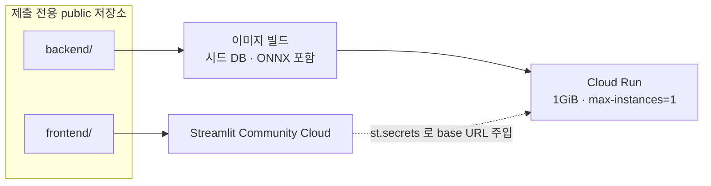

- **Vercel은 Streamlit을 구동할 수 없다.** 서버리스라 상시 프로세스와 WebSocket을 유지하지 못한다.
- 백엔드 base URL은 하드코딩하지 않고 `st.secrets` → 환경변수 순으로 읽는다.
- 아카이브 저장소에는 다른 미션의 실제 API 키가 존재하므로 private을 유지하고,
  **미션 18 코드만 담은 별도 public 저장소**를 만들어 배포용으로 쓴다.

### H-b. SQLite × 컨테이너 제약 — 실측

컨테이너 파일시스템에 쓰는 SQLite는 인스턴스가 교체되면 사라진다.
로컬 컨테이너로 이 상황을 재현해 확인했다.

| 조작 | 리뷰 수 |
|---|---|
| 시드 상태 | 72건 |
| 리뷰 30건 추가 후 | 102건 |
| `docker restart` (같은 컨테이너) | 102건 — 유지됨 |
| **새 컨테이너 기동** (인스턴스 교체 상당) | **72건 — 시드로 복귀** |

→ **배포본은 데모용이며, 영속 저장이 필요한 사용은 로컬 실행을 기준으로 한다.**
`--max-instances=1`로 고정해 인스턴스 간 DB 불일치도 함께 막는다.
운영을 전제한다면 Cloud SQL 같은 외부 DB로 바꿔야 하지만, 이번 미션의 평가 대상이 아니다.

### H-c. 현재 상태

코드·이미지·시드 DB는 배포 가능한 상태이며 컨테이너 동작까지 검증했다.
**클라우드 배포는 GCP 결제 계정이 닫혀 있어 보류 중이다**(계정 복구 후 진행 예정).
제출물 요건인 보고서와 코드는 배포 여부와 무관하게 충족한다.

---

## I. 성능 실측

컨테이너(`--memory=1g --cpus=1`, Cloud Run 상당) 기준이다.

### I-a. 응답 지연

| 엔드포인트 | p50 | p95 |
|---|---|---|
| `GET /movies` | 3.8ms | 4.9ms |
| `POST /sentiment/analyze` | 76.4ms | 82.7ms |
| `POST /reviews` (추론 포함) | 83.1ms | 91.4ms |

**추론이 지연의 대부분**을 차지하고 DB 조회는 4ms 안쪽이다.
추론을 등록 시 1회로 제한한 설계가 조회 화면의 응답성을 지켜 준다.

`intra_op_num_threads=1`로 고정해 측정했다. Cloud Run 1 vCPU를 가정한 값이며,
스레드 제한이 없던 미션 13 측정(p50 29ms)보다 느린 이유이기도 하다.

### I-b. 메모리

| 시점 | 사용량 |
|---|---|
| 기동 직후 (모델 로드 완료) | 153.3 MiB |
| 부하 후 피크 | **168.2 MiB / 1 GiB (16.4%)** |

계획 단계의 추정 피크는 400~600MB였는데 **실측은 그 절반 이하**였다.
`transformers` 없이 `tokenizers`만 쓴 선택이 실제로 효과를 냈다.
예산에 여유가 크므로 추가 대응은 하지 않았다.

### I-c. 테스트

`pytest` 23건이 통과한다. 상태 코드별 검증, 페이지네이션 경계(0건 / 10건 / 11건),
연쇄 삭제, 모델 미로드 시 폴백, OpenAPI 설명 누락 검사, 라벨 매핑 회귀 테스트를 포함한다.

---

## J. 마무리

### J-a. 이번 미션에서 판단이 갈렸던 지점

| 지점 | 선택 | 이유 |
|---|---|---|
| 평점 캐시 여부 | 캐시하지 않고 조회 시 집계 | 갱신 경로 3곳 중 하나만 빠뜨려도 평점이 조용히 틀어진다 |
| 리뷰 0건 평점 | `null` (0이 아님) | 0은 이미 '중립'의 의미를 갖는다 |
| 추론 실패 시 응답 | 201 (감성 필드만 `null`) | 리뷰 저장 자체는 성공했다 |
| 모델 로드 실패 | 앱을 죽이지 않음 | 영화 CRUD는 필수 기능이고 모델과 무관하다 |
| 저확신 대응 | 표기만, 보정 없음 | 관측치 없이 보정 장치를 먼저 만들지 않는다 |
| 토크나이저 | `tokenizers` 단독 | 메모리 예산에 직접 영향 |

### J-b. 남은 한계

1. **리뷰-영화 대응이 임의 배정**이라 평점 값 자체에는 의미가 없다.
   실제 서비스라면 영화별 실 리뷰를 수집해야 한다.
2. **도메인 이동으로 정확도가 약 7%p 낮다.** 영화 리뷰로 추가 파인튜닝하면 회복 가능하지만,
   이번 미션의 목적은 통합이지 모델 재학습이 아니라 범위 밖으로 두었다.
3. **중립 클래스가 가장 불안정하다.** 골든 케이스에서도 유일한 오분류가 중립이었고,
   확신도 역시 중립에서 가장 낮았다. 3단 표기를 유지하려면 중립 라벨의 학습 데이터 보강이 필요하다.
4. **배포본의 데이터는 영속되지 않는다.** 데모 목적에서는 문제가 없지만
   운영에는 외부 DB가 필요하다.
